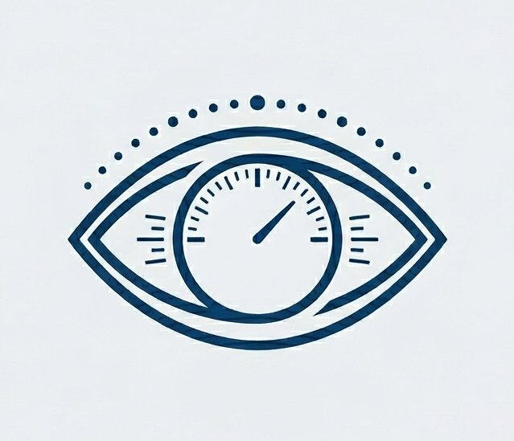

<p align="center">
  
</p>

<h1 align="center">Pupilómetro Clínico</h1>

<p align="center">
  <strong>Aplicación Android profesional para evaluación de reflejos pupilares</strong><br/>
  Kotlin · Jetpack Compose · CameraX
</p>

<p align="center">
  
  
  
  
</p>

---

## ¿Qué es?

**Pupilómetro Clínico** es una aplicación Android desarrollada en Kotlin con arquitectura MVVM que convierte cualquier smartphone Android en un instrumento de evaluación pupilar. Graba video en alta resolución siguiendo un protocolo clínico de tres fases, permitiendo el análisis posterior del reflejo pupilar fotomotor.

---

## Características principales

- **Grabación de alta resolución** — selecciona automáticamente la máxima calidad soportada por el sensor (UHD > FHD > HD > SD)
- **Protocolo de 3 fases** con tiempos configurables por el usuario
- **Tap-to-focus** con bloqueo de foco y exposición antes de grabar
- **Control preciso del flash** en modo antorcha (`enableTorch`)
- **Barra de progreso en tiempo real** con indicador de fase activa
- **Configuración persistente** mediante DataStore (los tiempos se guardan entre sesiones)
- **Almacenamiento en `Movies/Pupilometro/`** del dispositivo con nombre de archivo con timestamp

---

## Protocolo de grabación

```
┌─────────────────────────────────────────────────────────┐
│  [  FASE BASAL  ] → [⚡ FLASH ] → [  REDILATACIÓN  ]   │
│    (default 2s)       (1s)           (default 5s)        │
└─────────────────────────────────────────────────────────┘
```

| Fase | Variable | Default | Descripción |
|------|----------|---------|-------------|
| Basal | `tiempoBasal` | 2000 ms | Pupila en reposo antes del estímulo |
| Flash | `duracionFlash` | 1000 ms | Estímulo luminoso (antorcha encendida) |
| Redilatación | `tiempoRedilatacion` | 5000 ms | Recuperación pupilar tras el estímulo |

---

## ⚡ Latencias del flash — datos técnicos importantes

Para interpretar correctamente los videos, es fundamental conocer las latencias del hardware al encender y apagar el flash del teléfono.

### Latencia de encendido (`enableTorch(true)`)

| Condición | Latencia típica | Rango observado |
|-----------|----------------|-----------------|
| Flash frío (primera activación) | **~80–120 ms** | 60–200 ms |
| Flash caliente (reactivación rápida) | **~40–80 ms** | 30–120 ms |
| Dispositivos de alta gama (Pixel, Samsung S) | **~30–60 ms** | 20–80 ms |
| Dispositivos de gama media/baja | **~100–200 ms** | 80–350 ms |

### Latencia de apagado (`enableTorch(false)`)

| Condición | Latencia típica | Rango observado |
|-----------|----------------|-----------------|
| Apagado estándar | **~20–50 ms** | 15–80 ms |
| Dispositivos de alta gama | **~10–25 ms** | 8–40 ms |
| Dispositivos de gama media/baja | **~30–80 ms** | 20–120 ms |

> **⚠️ Consideración clínica:** El flash no se enciende ni apaga de forma instantánea. La latencia de encendido (~80–120 ms en promedio) significa que el estímulo real comienza ligeramente después del comando de software. Se recomienda:
> - Usar `duracionFlash` ≥ 800 ms para garantizar exposición completa
> - Al analizar el video, descontar ~1–2 frames del inicio de la fase de flash
> - Calibrar con el dispositivo específico midiendo la latencia con una fuente de luz de referencia

### Latencia total del ciclo de medición

```
Comando encendido ──[80–120ms lag]──► Flash visible en video
Flash visible     ──[duracionFlash]──► Comando apagado
Comando apagado   ──[20–50ms lag]───► Flash apagado en video

Imprecisión total acumulada: ±100–170 ms (gama media)
                             ±40–70 ms  (gama alta)
```

---

## Requisitos

- Android **8.0 (API 26)** o superior
- Cámara trasera con flash LED
- Permiso de cámara y micrófono

---

## Compilar (GitHub Actions — sin instalar nada)

1. Crear un repositorio en GitHub y subir todos los archivos
2. El workflow `.github/workflows/build.yml` se ejecuta automáticamente en cada push
3. Ir a **Actions → workflow completado ✅ → Artifacts → Pupilometro-debug-apk**
4. Descomprimir el ZIP descargado → `app-debug.apk`

---

## Arquitectura

```
com.pupilometro.app
├── MainActivity.kt              # Punto de entrada, navegación, permisos
├── data/
│   └── SettingsRepository.kt   # DataStore — persistencia de configuración
├── viewmodel/
│   ├── CameraViewModel.kt       # Lógica CameraX + protocolo de grabación
│   └── SettingsViewModel.kt     # Estado de la pantalla de ajustes
└── ui/
    ├── theme/Theme.kt           # Material3 tema oscuro
    └── screens/
        ├── CameraScreen.kt      # Vista principal de grabación
        ├── SettingsScreen.kt    # Configuración de tiempos
        └── AboutScreen.kt       # Créditos y contacto
```

---

## Autor

**Annier Jesús Fajardo Quesada**  
📧 [annierfq01@mail.com](mailto:annierfq01@mail.com)

---

## Licencia

```
MIT License — libre uso, modificación y distribución con atribución al autor.
```
